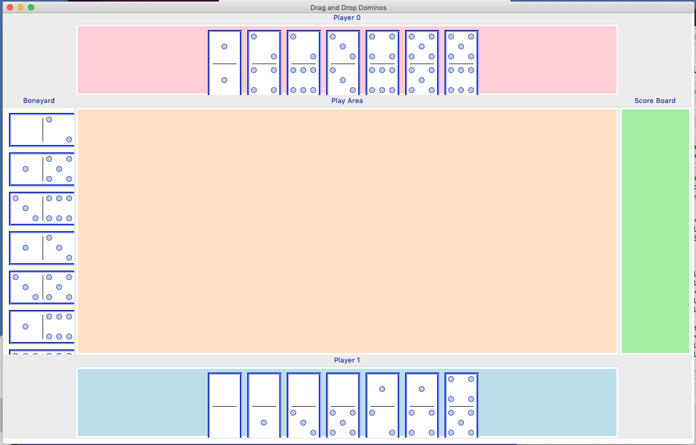
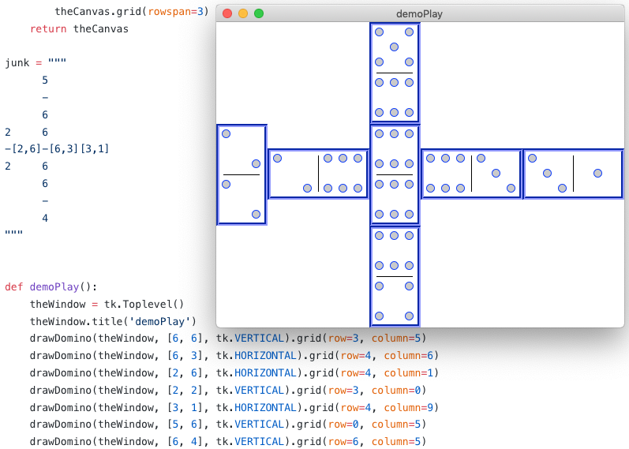

# Claussoft Dominos from Claussoft International
[__Racehorse dominos__](http://www.dominorules.com/racehorse)

Rules:
* Each player is initially dealt a hand of 7 dominos
* The remaining dominos go face down in the boneyard
* Dominos can only be played against matching numbers
* If no domino in a player's hand matches an outside domino then the player must take a domino from the boneyard until a domino can play or until the boneyard only has two dominos left
* If all outside dominos add up to a multiple of 5 then the player gets points (sum // 5) and goes again
* If the player plays doubles, they get to go again.  Note: Doubles are played sideways and when exposed count 2x.
* The player who has no dominos gets all points on the other player's dominos // 5
* First player to 30 points wins the match

$ __python3 DominoWorld.py__  # To play a text game on the terminal against the computer
```
Player 1's hand: 1 [[6, 6]]
================================
                         4     3
[6,2][2,5][5,6][6,1][1,4]-[4,3]-
                         4     3
                         4
                         -
                         5
================================
Playable: [3, 4, 5, 6], Value: 17
RECAP:playARun() run length: 6
1 Playing [4, 4] on [1, 4] is a double, go again...
2 Playing [2, 5] on [5, 6] 2.0 points, go again...
3 Playing [4, 3] on [4, 4] 1.0 points, go again...
4 Playing [4, 5] on [4, 4] 2.0 points, go again...
5 Playing [3, 3] on [4, 3] is a double, go again...
6 Playing [6, 2] on [2, 5]
Player 1 has 1 dominos, 9.0 points, 10 go agains, 1 hands and 0 games won.
```

$ __python3 tkDomino.py__  # To see the start of a [tkinter](https://docs.python.org/3/library/tk.html)-based ui


$ __python3 drawDomino.py__  # To see the layout of played Dominos in the tkinter ui

